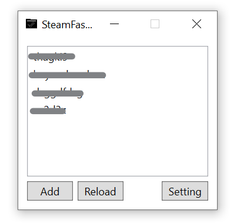
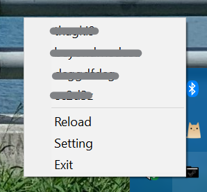

# SteamFastSwitcher
A fancy Windows GUI tool to switch steam account

### Screenshot

### Usage
* Switch Account: Double click the item in the list or click menu item from system tray icon
* Add Account: Click `Add` button on the main GUI and steam will be relaunched with no user login on. You should login yourself and check "Remember Password". After login with your new account manually, click `Reload` to reload account list
